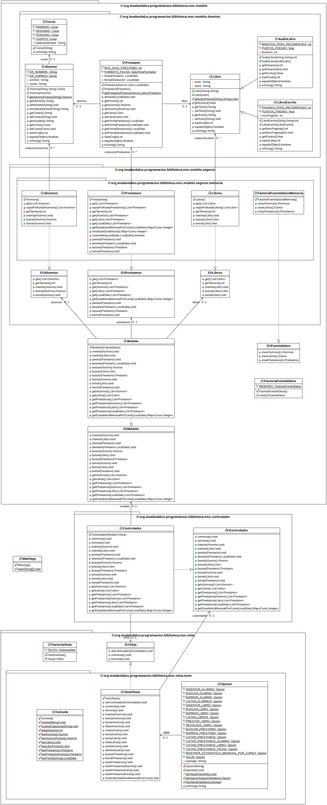

# Tarea: Biblioteca IES Al-Ándalus
## Profesor: José Ramón Jiménez Reyes
## Alumno: Marta Yebra González

Desde el IES Al-Ándalus ya nos han comentado que les gustaría que los datos fuesen persistentes en ficheros.

Antes de llevar a cabo dicho requisito queremos hacer un spring en el que refactoricemos lo que llevamos implementado hasta ahora para implementar de una forma adecuada el patrón Modelo-Vista-Controlador, ya que preveemos que tendremos varias vistas y varias modelos para nuestra aplicación.

Por ello, supondremos que en el futuro podremos tener varios modelos y que cada uno de ellos trabaje con una fuente de datos. También supondremos que tendremos varias vistas.

Hemos decidido implementar el patrón MVC en el que también haremos uso del patrón factoría. Como ya tenemos claros los conceptos de herencia, iremos definiendo las interfaces con las que vamos a trabajar y así que cada modelo o vista implemente dicha interfaz.

También nos han comentado que además de libros escritos, también poseen audiolibros (un libro estará en formato impreso o en formato de audio). El comportamiento para el préstamo de los audiolbros es exactamente el mismo, a excepción del número de puntos obtenido, que dependerá de la duración del audiolibro y que por cada 15 minutos de duración obtendremos 0,25 puntos.

Por tanto, esas serán las tareas que abarcaremos para este **tercer spring** de nuestra tarea.

El diagrama de clases queda como te muestro a continuación y poco a poco te iré explicando los diferentes pasos a realizar:

En este repositorio de GitHub hay un esqueleto de proyecto gradle que ya lleva incluidos todos los test necesarios que el programa debe pasar.

Por tanto, tu tarea va a consistir en completar los siguientes apartados:

1. Lo primero que debes hacer es realizar un **fork** del repositorio donde he colocado el proyecto gradle con la estructura del proyecto y todos los test necesarios. Clona tu repositorio remoto recién copiado en github a un repositorio local que será donde irás realizando lo que a continuación se te pide. Añade tu nombre al fichero `README.md` en el apartado "Alumno". Copia los ficheros del directorio `src/main/java` de tu tarea anterior al repositorio local. Realiza tu primer commit.
2. Haz que la clase `Libro` sea abstracta y que se adecúe al diagrama de clases. Realiza un commit.
3. Implementa la clase `LibroEscrito` que extienda la clase `Libro` y que se comporte exactamente igual que antes se comportaba la clase `Libro`. Para que todo siga funcionando correctamente deberás modificar alguna que otra clase más. Realiza un commit.
4. Implementa la clase `AudioLibro` que extienda la clase `Libro` y que se comporte como se indica en el enunciado. Para que todo siga funcionando correctamente deberás modificar alguna que otra clase más. Realiza un commit. 
5. Refactoriza la clase `Alumnos`, extrayendo su interfaz y colocando la clase y la interfaz en el paquete adecuado. Realiza un commit.
6. Refactoriza la clase `Libros`, extrayendo su interfaz y colocando la clase y la interfaz en el paquete adecuado. Realiza un commit.
7. Refactoriza la clase `Prestamos`, extrayendo su interfaz y colocando la clase y la interfaz en el paquete adecuado. Realiza un commit.
8. Crea la clase `FactoriaFuenteDatosMemoria` con los métodos indicados en el diagrama de clases que devolverán cada una de las interfaces creadas pero que serán los correspondientes objetos del paquete memoria. Extrae la interfaz de esta clase y colócala en el paquete adecuado. Realiza un commit.
9. Modifica la clase `Modelo` para que en su constructor acepte como parámetro una fuente de datos (su interfaz `IFuenteDatos`) y cree los diferentes objetos llamando a los métodos de dicha interfaz. Extrae la interfaz del modelo. Realiza un commit.
10. Crea el enumerado `FactoriaFuenteDatos` que tendrá un método abstracto llamado `crear` y que tendrá una única instancia, por ahora, etiquetada como `MEMORIA` y que nos devolverá la implementación de la interfaz `IFuenteDatos` que anteriormente hemos creado (`FactoriaFuenteDatosMemoria`). Realiza un commit.
11. Refactoriza la clase `Vista`, renombrándola, extrayendo su interfaz y colocando las clases y la interfaz en los paquetes adecuados. Realiza un commit.
12. Crea el enumerado `FactoriaVista` que tendrá un método abstracto llamado `crear` y que tendrá una única instancia, por ahora, etiquetada como `TEXTO` y que nos devolverá la implementación de la interfaz `IVista` que anteriormente hemos creado (`VistaTexto`). Realiza un commit.
13. Refactoriza la clase `Controlador`, extrayendo su interfaz. Realiza un commit.
14. Modifica la clase `MainApp`, para que en la creación del modelo le pase la fuente de datos utilizando la factoría anteriormente creada. También a la hora de crear la vista debe utilizar la factoría anteriormente creada. Realiza un commit y sube los cambios a tu repositorio remoto en GitHub.

###### Se valorará:
- La indentación debe ser correcta en todas las clases.
- El nombre de las variables debe ser adecuado.
- Se debe utilizar la clase `Entrada` para realizar la entrada por teclado.
- El proyecto debe pasar todas las pruebas que van en el esqueleto del mismo y toda entrada del programa será validada para evitar que el programa termine abruptamente debido a una excepción.
- Se deben utilizar los comentarios adecuados.
- Se valorará la corrección ortográfica tanto en los comentarios como en los mensajes que se muestren al usuario.

